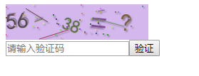

# gVerify
Simple graphic validation tools by javascript


fork from  wangjiangman/gVerify

### 修改：

+ 增加算术验证码
+ 增加使用说明

### 用法：

```html
<body>
  <div id="v_container" style="width: 200px;height: 50px;"></div>
  <input type="text" id="code_input" value="" placeholder="请输入验证码" /><button id="my_button">验证</button>
</body>
<script src="gVerify.js"></script>
<script>
    // option 可为对象或者字符串 为字符串可直接填写容器ID，本例中为 v_container
    // var option =  { //默认options参数值
    //   id: "", //容器Id
    //   canvasId: "verifyCanvas", //canvas的ID
    //   width: "100", //默认canvas宽度
    //   height: "30", //默认canvas高度
    //   type: "blend", //图形验证码默认类型blend:数字字母混合类型、number:纯数字、letter:纯字母、calc:计算
    //   code: "", //用来保存code
    //   length: 4//验证码长度
    // } 

  var option = 'v_container';
  var verifyCode = new GVerify(option);
  document.getElementById("my_button").onclick = function () {
    var res = verifyCode.validate(document.getElementById("code_input").value);
    if (res) {
      alert("验证正确");
    } else {
      alert("验证码错误");
    }
  }
</script>

```


